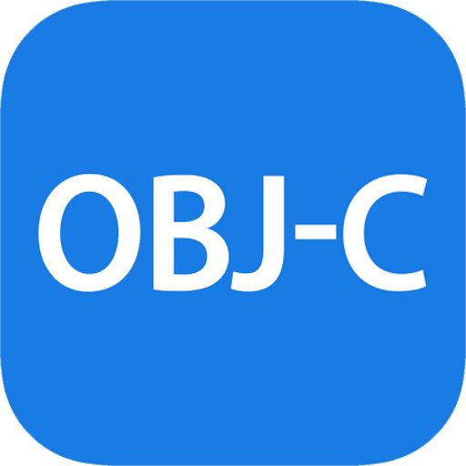
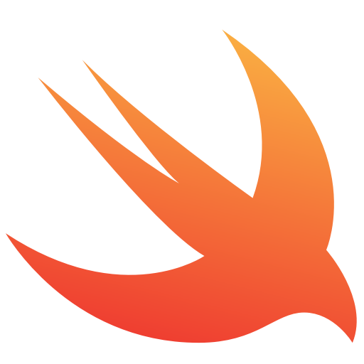

## Hi 👋 my name is Bailey Costello
full stack developer / cloud engineer / native app dev / video game enthusiast

Been programming for 10+ years.

Passionate about how programming can have a positive impact in business 

### *Languages:*  

     

     

    

### *Tools:*  

     

       

   

    

 
 
 

<!--
**TheJavaCoder/TheJavaCoder** is a ✨ _special_ ✨ repository because its `README.md` (this file) appears on your GitHub profile.

Here are some ideas to get you started:

- 🔭 I’m currently working on ...
- 🌱 I’m currently learning ...
- 👯 I’m looking to collaborate on ...
- 🤔 I’m looking for help with ...
- 💬 Ask me about ...
- 📫 How to reach me: ...
- 😄 Pronouns: ...
- ⚡ Fun fact: ...
-->
