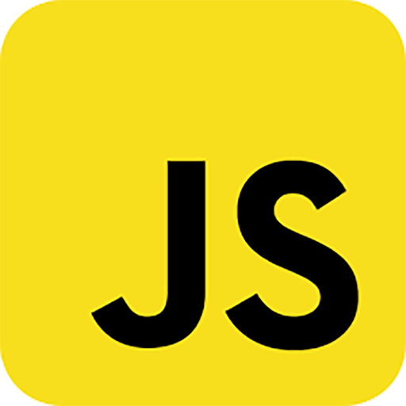

### Hi there 👋 my name is Bailey Costello
I'm a full stack developer / cloud engineer / native app dev / video game enthusiast

Been programming for 10+ years.

Passionate about how programming can have a positive impact in business 

*languages I program in:*  
           

*Tools I use:*  
              
 
     
 
  

switch(state)  
{

  case "🔭 currently working", "🌱 currently learning", "👯 looking to  collaborate":   &emsp; return "on Open Source Kubernetes Management";  

  case "📫 reach me": 
  &emsp; return " email: bapcos@gmail.com, phone: 404-394-1810";  
}

<!--
**TheJavaCoder/TheJavaCoder** is a ✨ _special_ ✨ repository because its `README.md` (this file) appears on your GitHub profile.

Here are some ideas to get you started:

- 🔭 I’m currently working on ...
- 🌱 I’m currently learning ...
- 👯 I’m looking to collaborate on ...
- 🤔 I’m looking for help with ...
- 💬 Ask me about ...
- 📫 How to reach me: ...
- 😄 Pronouns: ...
- ⚡ Fun fact: ...
-->
